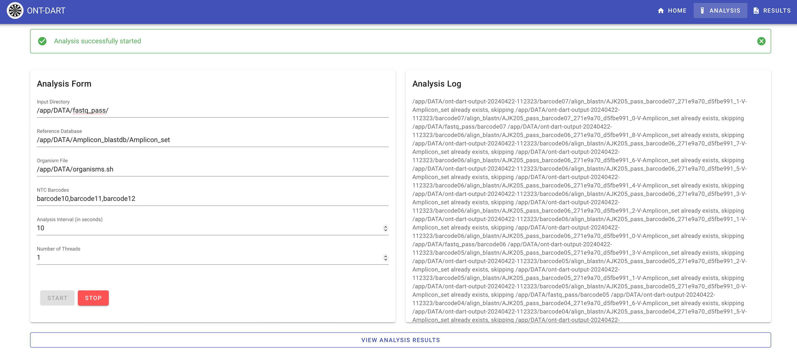
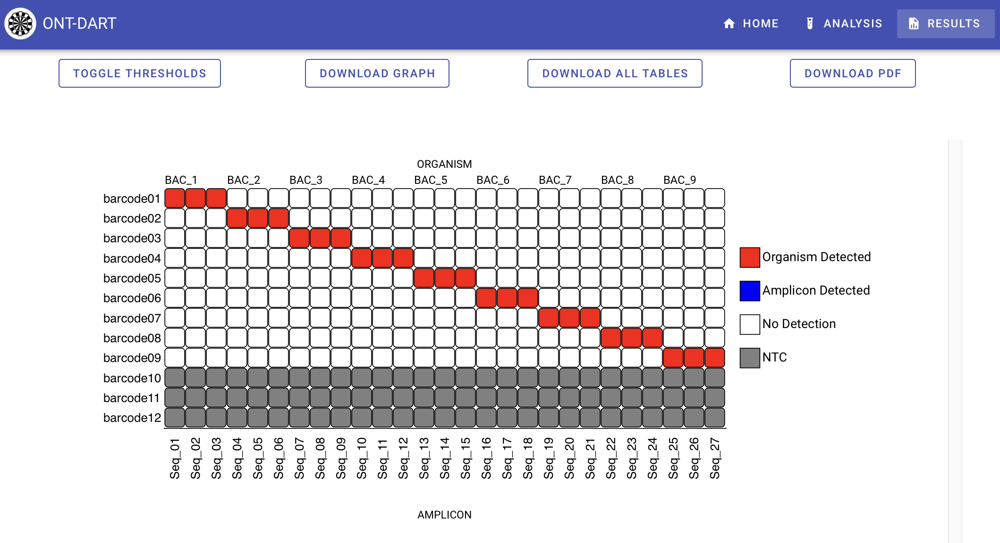

## Disclaimer

> NO WARRANTY, NO LIABILITY. THIS MATERIAL IS PROVIDED “AS IS.” JHU/APL MAKES NO
REPRESENTATION OR WARRANTY WITH RESPECT TO THE PERFORMANCE OF THE MATERIALS, INCLUDING
THEIR SAFETY, EFFECTIVENESS, OR COMMERCIAL VIABILITY, AND DISCLAIMS ALL WARRANTIES IN
THE MATERIAL, WHETHER EXPRESS OR IMPLIED, INCLUDING (BUT NOT LIMITED TO) ANY AND ALL
IMPLIED WARRANTIES OF PERFORMANCE, MERCHANTABILITY, FITNESS FOR A PARTICULAR PURPOSE,
AND NON-INFRINGEMENT OF INTELLECTUAL PROPERTY OR OTHER THIRD PARTY RIGHTS. ANY USER OF
THE MATERIAL ASSUMES THE ENTIRE RISK AND LIABILITY FOR USING THE MATERIAL. IN NO EVENT
SHALL JHU/APL BE LIABLE TO ANY USER OF THE MATERIAL FOR ANY ACTUAL, INDIRECT,
CONSEQUENTIAL, SPECIAL OR OTHER DAMAGES ARISING FROM THE USE OF, OR INABILITY TO USE,
THE MATERIAL, INCLUDING, BUT NOT LIMITED TO, ANY DAMAGES FOR LOST PROFITS.

The code contained in this repository is published to accompany a scientific research paper.
As such, the code is not designed to be used turn-key for any other purpose. Some portions of the code may
make assumptions that are specific to the associated paper, and/or may not be fit for production use. JHU/APL
will not be monitoring this repository for any merge requests/issues/etc.

The code as provided has also been modified to include a different set of amplicons than the original paper
presents.

# ONT-DART
_nanopore Detection of Amplicons in Real-Time_

The scripts in this repository are designed for a very specific amplicon use-case, and are part of the nanoDART (nanopore Detection of Amplicons in Real-Time) analysis pipeline.
The input directory should be the standard Oxford Nanopore Technologies (ONT) MinKNOW software output named `fastq_pass`.
Each set of reads per barcode within this directory are aligned to an amplicon database with `blastn`.
The analysis is meant to be in 'real-time', meaning as reads are output from the basecalling algorithm of guppy (or whatever the standard is at the time) into the `fastq_pass` directory, they will be concatentated and analyzed at a user-define interval.
Visualization of output results from this processing pipeline are part of the front-end GUI application.

## Running ONT-DART Web Application in Development

This is for testing out the nanoDART web application on your machine for development purposes.

Before going through the steps, make sure Docker is installed on your machine: https://docs.docker.com/get-docker/. You'll also need to have access to the nanoDART accessory files for the blastn database. Copy the nanoDART accessory files directory into the project's root directory.

- Open terminal and navigate to the project's root directory.
- To build the Docker image for nanoDART, run the following command: `./build_image.sh`. This will properly bundle the frontend and backend web application files together and create a Docker image with the name **nanodart**.
- Finally, to run the web application, run the following command: `docker run  -p 5000:5000 nanodart`. The web application can now be reached at the following URL: http://localhost:5000.

## Installing nanoDART Web Application to MK1C

Before going through the steps, make sure Docker is installed on your machine: https://docs.docker.com/get-docker/. You'll also need to have access to the nanoDART accessory files for the blastn database. Copy the nanoDART accessory files directory into the project's root directory.

- Open terminal and navigate to the project's root directory.
- To build the Docker image for nanoDART that is compatible with the MK1C, run the following command: `./build_and_save_image_arm64.sh`. This will generate a file named **nanodart.tar.gz** in your current directory which is the nanoDART Docker image that has been saved as a file.
- Transfer the Docker image file to the MK1C. This can be done through methods like USB or SSH (user: minit, password: minit).
- Through command line on the MK1C (either directly on the device or through SSH), run the following command: `docker load < /path/to/file/nanodart.tar.gz`. This will load the nanoDART Docker image onto the MK1C.

## NOTES:
	The target environment for this code is an Oxford Nanopore Technologies (ONT) MinION Mk1C,
	running Ubuntu 16.04 LTS. To build the Docker image for use on the Mk1C, Docker 20+ is needed
	for `buildx` support. Building the frontend Vue.js site locally for development requires
	nodeJS 16+/npm 7+.

	- dependencies: GNU Parallel [1], GNU Core Utils, blastn [2]
	- awk and blastn need to be in $PATH variable
	- please index reference fasta with 'makeblastdb -dbtype nucl -in <FNA>'
	- the input fastq_pass (-i) directory should have subfolders named for barcodes.
    - for this use-case, subfolder names are expected to be from 'barcode01' to 'barcode12'.

## Usage

Upon opening the nanoDART website, you will be presented with three tabs.
To begin the process, select the "Analysis" tab.

The analysis form requires an input directory, NTC barcodes, analysis interval, and number of threads.
For more information on these fields, hover over them to see a tooltip description.

Once ready, you can begin the analysis using the "Start" button at the bottom. Next to that is
the "Stop" button, which will stop the process at any time. An analysis log is provided on the right
side to display progress.

To view the results, you can select the "Results" tab at the top toolbar.

Hovering over a cell on the heatmap will display the specific read count for an amplicon

Further below on the results page, a series of tables will display summaries of the detected organisms

...as well as read alignments to individual amplicons, and read alignments among NTC barcodes.

# NanoMonitor

### Non-Template Control (NTC) samples:

	Three of the 12 barcodes (01 through 12) are reserved for NTCs.
	Use (-n) parameter to indicate which barcodes were used for the NTCs (eg. barcode01,barcode02,barcode03).

### Positive detection thresholds will be indicated in comments where they occur:

	T1. per read alignment thresholds (>=90% alignment identity and length)
	T2. per sample threshold (>2% total aligned read count)
	T3. per flow cell threshold (based on NTCs, amplicon called negative if:
		(NTC mean+(3*stdev)) > (sample count)

## Output

#### PRIMARY OUTPUT FORMAT: plot.tsv

	1	barcode (e.g. barcode01)
	2	sample type (sample or control)
	3	<org>,<amplicon_id>
	4	amplicon aligned read count (INT)
	5	proportion of flowcell total aligned reads
	6	detection after T2: 1 if amplicon count >2% total aligned read count, 0 if not
	7	mean NTC amplicon aligned read count
	8	standard deviation NTC amplicon aligned read count
	9	detection after T3: 1 if (col7+{3*col8}) > col4, 0 if not
	10	final call for amplicon detection; see below
				condition			final_call	description
			if col6==0 && col9==0	negative	amplicon not detected in sample or control
			if col6==0 && col9==1	negative	amplicon not detected in sample but was detected in control
			if col6==1 && col9==0	positive	true positive, amplicon detected in sample but not control
			if col6==1 && col9==1	negative	amplicon detected in sample and control
	11	org code
	12	organism full name (Genus species)
	13	organism detection; 1 if all organism-associated amplicons are 'positive' (col10), 0 if not
	14	number of organism associated amplicons
	15	mean org associated amplicon read count

#### SECONDARY OUTPUT FORMAT: org.tsv

	1	barcode
	2	org code
	3	org full name (Genus species)
	4	detection (1 if all 'org associated amplicons are positive', 0 if not)
	5	number of organism associated amplicons
	6	mean org associated amplicon read count

## usage:

1. Provide blast database of organim sequences for alignment. 

2. Update organisms.sh to correspond to barcodes and names of organisms.

`bash nanomonitor.sh -t <INT> -a <INT> -i <DIR> -n <01-12> -r <FNA> -o <DIR>`

#### Args:

	-h      show this message
	-t	INT	num threads
	-a	INT	analysis interval; number of seconds between analysis updates [10]
	-i	DIR	input directory <path/to/rundir/fastq_pass> (MinKNOW output dir structure)
	-n	STR	commas separated list of barcodes used for NTCs (eg. "barcode01,barcode02,barcode03")
	-r	FNA	reference fasta used for blastn (please index with makeblastdb)
	-o	DIR	output directory

#### Example:
	
run nanomonitor:

    ref="/data/refdata/phase2/amplicons/blastdb_all_amplicons"
    bash nanomonitor.sh -t 4 -a 20 -i ../fastq_pass/ -n barcode10,barcode11,barcode12 -r "$ref" -o ../testing_dart

References:

	1. O. Tange (2011): GNU Parallel - The Command-Line Power Tool, ;login: The USENIX Magazine, February 2011:42-47.
    2. Altschul, S.F., Gish, W., Miller, W., Myers, E.W. & Lipman, D.J. (1990) "Basic local alignment search tool." J. Mol. Biol. 215:403-410. https://www.ncbi.nlm.nih.gov/pubmed/2231712?dopt=Citation
